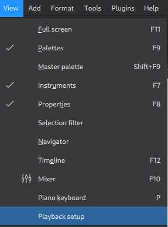
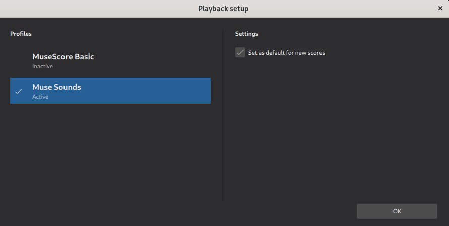
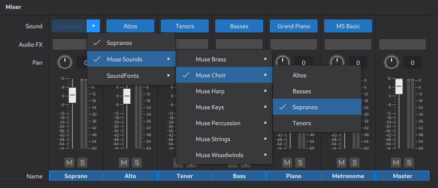

## Muse Hub

### Problem

[Muse Hub](https://musescore.org/en/download) is only available as a Debian package.

I use Fedora 37

### Solution

[Suggestions from QuotePilgrim](https://musescore.org/en/node/337059) on how to convert the Debian to a Fedora Package. Credits to him :)

### Install variant 1: Installing the prebuilt RPM

The simplest way to install is by using the RPM created by me and shared within this repo:

`sudo rpm -i --nodeps ./dist/muse-hub-1.0.1.451-2.x86_64.rpm`

### Install variant 2: Building and installing the RPM yourself

To produce the RPM yourself you can
- `./fedora.sh`
- the script will run rpmrebuild near the end
  - this will open the rpm spec file in your default editor (nano for me)
  - the is a section whose start is indicated by **%files** at the start
  - in that section drop any line mentioning files or directories that already exist on Fedora
    - I only had to drop directories, for example `%dir %attr(0755, root, root) "/usr"`
  - close the editor and save the file
  - confirm the rpmrebuilds `Do you want to continue ? (y/N)` with `y`
  - the script will now install the created RPM

`./fedora.sh` contains the URL to the Muse Hub Debian file available as of 01-31-2023 . In case that becomes unavailable or the checksum changes the script will abort.

If so just update the URL and disable the script sections verifying the checksum.

### Issues

1. Muse Score
   - The Flatpak variant did not detect Muse Sounds installed using Muse Hub for me, I use the [AppImage Variant](https://musescore.org/en/download)
2. Muse Hub
   - Right after Muse Hub finished downloading the Muse Sounds I noticed it had a memory leak `sudo systemctl status muse-hub.service` was showing it using about 12GB of memory. I restarted it using `sudo systemctl restart muse-hub.service` and the issue has not happend again since, the memory usage is around 50MB.
   - The Muse Hub Systemd service runs as root, this is very bad for security.
   - The Muse Hub service starts at boot by default, you can disable it using `sudo systemctl disable muse-hub.service` and choose to start/stop manually if you like
     - start: `sudo systemctl start muse-hub.service`
     - stop: `sudo systemctl stop muse-hub.service`

### Confirm that Muse Sounds work

### Using Muse Sounds in the Mixer

### Disclaimer

I have no knowledge/clue of Fedora packaging and just wanted to replicate the steps from the proposed solution and share it if it works for me.

Use at your own risk.